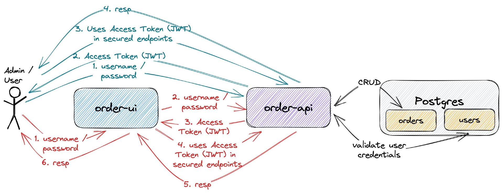
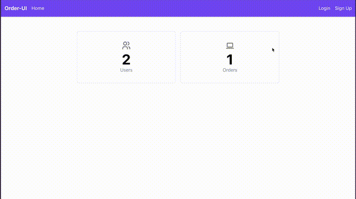
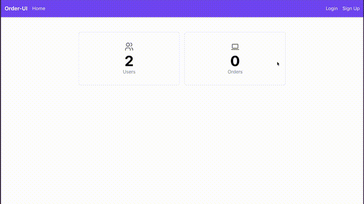

# springboot-react-jwt-token

The goal of this project is to implement an application called `order-app` to manage orders. For it, we will implement a back-end [`Spring Boot`](https://docs.spring.io/spring-boot/index.html) application called `order-api` and a font-end [React](https://react.dev/) application called `order-ui`. Besides, we will use [`JWT Authentication`](https://en.wikipedia.org/wiki/JSON_Web_Token) to secure both applications.

## Proof-of-Concepts & Articles

On [ivangfr.github.io](https://ivangfr.github.io), I have compiled my Proof-of-Concepts (PoCs) and articles. You can easily search for the technology you are interested in by using the filter. Who knows, perhaps I have already implemented a PoC or written an article about what you are looking for.

## Additional Readings

- \[**Medium**\] [**Implementing A Full Stack Web App Using Spring-Boot and React**](https://medium.com/@ivangfr/implementing-a-full-stack-web-app-using-spring-boot-and-react-7db598df4452)
- \[**Medium**\] [**Implementing Social Login in a Spring Boot and React App**](https://medium.com/@ivangfr/implementing-social-login-in-a-spring-boot-and-react-app-6ce073c9983c)
- \[**Medium**\] [**Building a Web Chat with Social Login using Spring Boot: Introduction**](https://medium.com/@ivangfr/building-a-web-chat-with-social-login-using-spring-boot-introduction-644702e6be8e)
- \[**Medium**\] [**Building a Single Spring Boot App with Keycloak or Okta as IdP: Introduction**](https://medium.com/@ivangfr/building-a-single-spring-boot-app-with-keycloak-or-okta-as-idp-introduction-2814a4829aed)

## Project Diagram



## Applications

- ### order-api

  `Spring Boot` Web Java backend application that exposes a Rest API to create, retrieve, and delete orders. If a user has the `ADMIN` role, he/she can also retrieve information of other users or delete them.
  
  The application's secured endpoints can only be accessed if a valid JWT access token is provided.
  
  `order-api` stores its data in [`Postgres`](https://www.postgresql.org/) database.

  `order-api` has the following endpoints:

  | Endpoint                                                      | Secured | Roles           |
  | ------------------------------------------------------------- | ------- | --------------- |
  | `POST /auth/authenticate -d {"username","password"}`          | No      |                 |
  | `POST /auth/signup -d {"username","password","name","email"}` | No      |                 |
  | `GET /public/numberOfUsers`                                   | No      |                 |
  | `GET /public/numberOfOrders`                                  | No      |                 |
  | `GET /api/users/me`                                           | Yes     | `ADMIN`, `USER` |
  | `GET /api/users`                                              | Yes     | `ADMIN`         |
  | `GET /api/users/{username}`                                   | Yes     | `ADMIN`         |
  | `DELETE /api/users/{username}`                                | Yes     | `ADMIN`         |
  | `GET /api/orders [?text]`                                     | Yes     | `ADMIN`         |
  | `POST /api/orders -d {"description"}`                         | Yes     | `ADMIN`, `USER` |
  | `DELETE /api/orders/{id}`                                     | Yes     | `ADMIN`         |

- ### order-ui

  `React` frontend application where a user with role `USER` can create an order and retrieve a specific order. On the other hand, a user with role `ADMIN` as access to all secured endpoints.
  
  In order to access the application, a `user` or `admin` must log in using his/her `username` and `password`. All the requests coming from `order-ui` to secured endpoints in `order-api` include the JWT access token. This token is generated when the `user` or `admin` logs in.
  
  `order-ui` uses [`Semantic UI React`](https://react.semantic-ui.com/) as a CSS-styled framework.

## Prerequisites

- [`npm`](https://docs.npmjs.com/downloading-and-installing-node-js-and-npm)
- [`Java 21`](https://www.oracle.com/java/technologies/downloads/#java21) or higher;
- A containerization tool (e.g., [`Docker`](https://www.docker.com), [`Podman`](https://podman.io), etc.)
- [`jq`](https://jqlang.github.io/jq/)

## Start Environment

- In a terminal, make sure you are inside the `springboot-react-jwt-token` root folder;

- Run the following command to start Docker Compose containers:
  ```bash
  docker compose up -d
  ```

## Running order-app using Maven & Npm

- **order-api**

  - Open a terminal and navigate to the `springboot-react-jwt-token/order-api` folder;

  - Run the following `Maven` command to start the application:
    ```bash
    ./mvnw clean spring-boot:run
    ```

- **order-ui**

  - Open another terminal and navigate to the `springboot-react-jwt-token/order-ui` folder;

  - Run the command below if you are running the application for the first time:
    ```bash
    npm install
    ```

  - Run the `npm` command below to start the application:
    ```bash
    npm start
    ```

## Applications URLs

| Application | URL                                   | Credentials                                         |
| ----------- | ------------------------------------- | --------------------------------------------------- |
| order-api   | http://localhost:8080/swagger-ui.html |                                                     |
| order-ui    | http://localhost:3000                 | `admin/admin`, `user/user` or signing up a new user |

> **Note**: the credentials shown in the table are the ones already pre-defined. You can signup new users.

## Demo

- The gif below shows a `user` loging in:

  

- The gif below shows an `admin` loging in:

  

## Testing order-api Endpoints

- **Manual Endpoints Test using Swagger**
  
  - Open a browser and access http://localhost:8080/swagger-ui.html. All endpoints with the lock sign are secured. In order to access them, you need a valid JWT access token;

  - Click `POST /auth/authenticate` and then, click `Try it out` button;
  
  - Provide the `user` credentials `username` and `password`:
    ```json
    { "password": "user", "username": "user" }
    ```
  
  - Click the `Execute` button. It should return something like:
    ```text
    Code: 200
    { "accessToken": "eyJ0eXAiOiJKV1QiLCJhbGciOiJIUzUxMiJ9..." }
    ```
    > **Note 1**: You can use the `admin` credentials to access more secured endpoints.
    >
    > **Note 2**: The token will expire in **10 minutes**.

  - Copy the `accessToken` value (**without** the double quotes);
  
  - Click the `Authorize` button at the top of the page;
  
  - In `Value` input field, paste the copied token;
  
  - Click the `Authorize` button and then, click the `Close` button;
  
  - To create an order, click `POST /api/orders` and then, click the `Try it out` button;

  - Provide the `description` of the order:
    ```json
    { "description": "Buy two iPhones" }
    ```

  - Click the `Execute` button. It should return something like:
    ```text
    Code: 200
    {
      "id": "718c9f40-5c06-4571-bc3e-3f888c52eff2",
      "description": "Buy two iPhones",
      "user": { "username": "user" },
      "createdAt": "..."
    }
    ```

- **Manual Endpoints Test using curl**

  - Open a terminal;
  
  - Call `GET /public/numberOfUsers`:
    ```bash
    curl -i localhost:8080/public/numberOfUsers
    ```
    It should return:
    ```text
    HTTP/1.1 200
    2
    ```

  - Call `GET /api/orders` without JWT access token:
    ```bash
    curl -i localhost:8080/api/orders
    ```
    As for this endpoint a valid JWT access token is required, it should return:
    ```text
    HTTP/1.1 401
    ```

  - Call `POST /auth/authenticate` to get the `admin` JWT access token:
    ```bash
    ADMIN_ACCESS_TOKEN="$(curl -s -X POST http://localhost:8080/auth/authenticate \
      -H 'Content-Type: application/json' \
      -d '{"username": "admin", "password": "admin"}' | jq -r .accessToken)"
    echo $ADMIN_ACCESS_TOKEN
    ```

  - Call `GET /api/orders` again, now with the `admin` JWT access token:
    ```bash
    curl -i -H "Authorization: Bearer $ADMIN_ACCESS_TOKEN" localhost:8080/api/orders
    ```
    It should return an empty array or an array with orders:
    ```text
    HTTP/1.1 200
    [ ... ]
    ```

  - Call `GET /api/users/me` to get more information about the `admin`:
    ```bash
    curl -i -H "Authorization: Bearer $ADMIN_ACCESS_TOKEN" localhost:8080/api/users/me
    ```
    It should return:
    ```text
    HTTP/1.1 200
    {
      "id": 1, "username": "admin", "name": "Admin", "email": "admin@mycompany.com", "role": "ADMIN",
      "orders": []
    }
    ```

- **Automatic Endpoints Test**

  - Open a terminal and make sure you are in the `springboot-react-jwt-token` root folder;

  - Run the following script:
    ```bash
    ./order-api/test-endpoints.sh
    ```
    It should return something like the output below, where it shows the http code for different requests:
    ```text
    POST auth/authenticate
    ======================
    admin access token
    ------------------
    eyJ0eXAiOiJKV1QiLCJhbGciOiJIUzUxMiJ9.eyJleHAiOjE1ODY2MjM1MjksImlhdCI6MTU4Nj..._ha2pM4LSSG3_d4exgA
    
    user access token
    -----------------
    eyJ0eXAiOiJKV1QiLCJhbGciOiJIUzUxMiJ9.eyJleHAiOjE1ODY2MjM1MjksImlhdCIyOSwian...Y3z9uwhuW_nwaGX3cc5A
    
    POST auth/signup
    ================
    user2 access token
    ------------------
    eyJ0eXAiOiJKV1QiLCJhbGciOiJIUzUxMiJ9.eyJleHAiOjE1ODY2MjM1MjksImanRpIjoiYTMw...KvhQbsMGAlFov1Q480qg
    
    Authorization
    =============
                    Endpoints | without token |  user token |  admin token |
    ------------------------- + ------------- + ----------- + ------------ |
     GET public/numberOfUsers |           200 |         200 |          200 |
    GET public/numberOfOrders |           200 |         200 |          200 |
    ......................... + ............. + ........... + ............ |
            GET /api/users/me |           401 |         200 |          200 |
               GET /api/users |           401 |         403 |          200 |
         GET /api/users/user2 |           401 |         403 |          200 |
      DELETE /api/users/user2 |           401 |         403 |          200 |
    ......................... + ............. + ........... + ............ |
              GET /api/orders |           401 |         403 |          200 |
             POST /api/orders |           401 |         201 |          201 |
      DELETE /api/orders/{id} |           401 |         403 |          200 |
    ------------------------------------------------------------------------
     [200] Success -  [201] Created -  [401] Unauthorized -  [403] Forbidden
    ```

## Util Commands

- **Postgres**
  ```bash
  docker exec -it postgres psql -U postgres -d orderdb
  \dt
  ```

- **jwt.io**

  With [jwt.io](https://jwt.io), you can input the JWT token, and the online tool decodes the token, showing its header and payload.

## Shutdown

- To stop `order-api` and `order-ui`, go to the terminals where they are running and press `Ctrl+C`;

- To stop and remove Docker Compose containers, network, and volumes, go to a terminal and, inside the `springboot-react-jwt-token` root folder, run the command below:
  ```bash
  docker compose down -v
  ```

## How to upgrade order-ui dependencies to latest version

- In a terminal, make sure you are in the `springboot-react-jwt-token/order-ui` folder;

- Run the following commands:
  ```bash
  npm upgrade
  npm i -g npm-check-updates
  ncu -u
  npm install
  ```

## References

- https://www.callicoder.com/spring-boot-security-oauth2-social-login-part-2/#jwt-token-provider-authentication-filter-authentication-error-handler-and-userprincipal
- https://bezkoder.com/spring-boot-jwt-authentication/
- https://dev.to/keysh/spring-security-with-jwt-3j76
